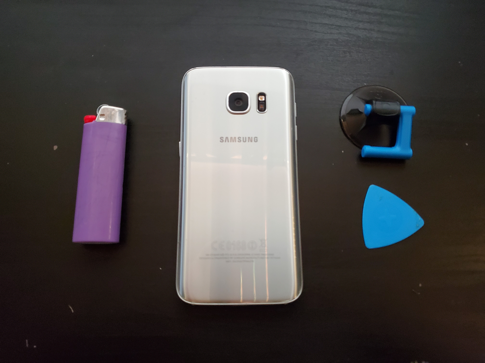
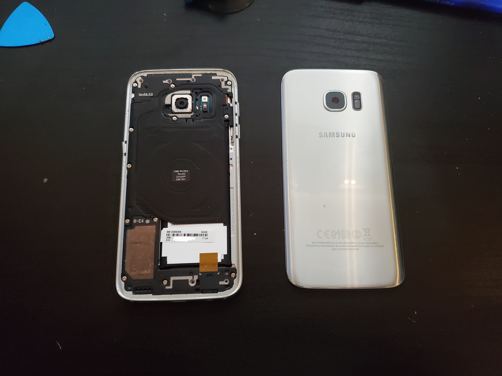

Today I decided to take the back off of an old broken Samsung Galaxy S7. 

For some reason, I happen to have 4 galaxy S7 phones, 3 of them work (depending on how you consider "working"), and one (this one), is completely dead. The board (probably memory) is dead so it will hard crash every few minutes with no logs or anything. Also, the screen has burn in, so it is not worth saving the screen either. 

I did not really have all the tools that I needed to do this, so I made do with a lighter as the heat source. I would not use this on a real device I cared about, but as I mentioned, this device was broken and practically worthless (with a bad screen as well). So what better place to learn!!

> Do not do this at home as lighters are dangerous.

## Removing the Back Glass
There is a very well known procedure to get into phones like this by heating the adhesive (I used a lighter), then using the suction cup to get a gap between the back glass and the frame, then using a plastic pick to cut through the adhesive and remove the back glass. 

This actually went very well, and as seen below, the back glass came off with no problems. 

## More Dissasembly
I also took apart the entire device, I do not have pictures of it all, but I took out the wireless charging coil, mainboard, battery (this was a challenge, I used a jimmy tool to get under that battery from the side)speaker, camera, and lots of stuff. I did not find anything off (as expected) which supports my theory of a board issue. 

After this I put the device back together, and it still crashed often, but a good thing is everything tested (I could not test too much since I could not really boot into an OS) worked. Screen was still fine, it charged fine, haptics worked, and so on. I do not think I broke anything through taking it apart :-)

So all in all, fun experience and maybe someday I can take apart my pixel 7 to fix my broken camera!! Although I have to get in by the screen with that one and that is more risky. I would at least want to get a proper heat pad before doing that. 