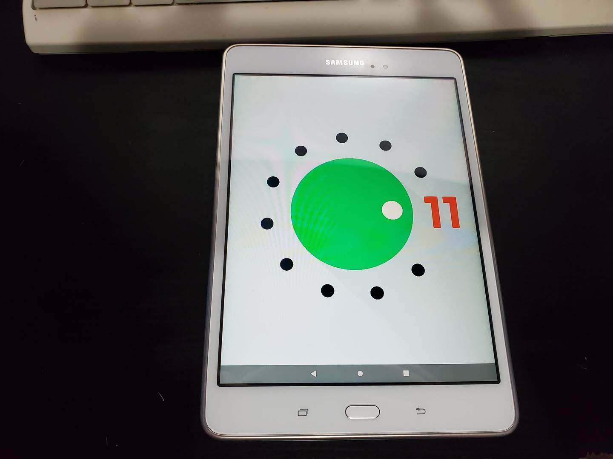

I decided to procrastinate and not study for my exams, and instead try to put lineageos on gt58wifi (Samsung Galaxy Tab A 8.0 2015). 

To do this I know the process, I need to unlock the bootloader, then use ODIN3 to flash a custom recovery, and then I can use ADB to install the actual operating system. 

I found some online builds of lineageos and TWRP, specifically TWRP 3.5.9 and lineageos 18.1 GO. Now I have done this over and over again on lots of devices, so I thought no problem this will take 10 minutes, and then I am done. This was however not the case. It took a lot of effort to actually get the recovery onto the device. Firstly the device showed up in ODIN3, but whenever I tried to flash the recovery, it crashed. No matter what I did. Official firmware worked, but unofficial did not. 

After a lot of tinkering I found out that this file I found online was distributed in img format, and they need to be in a tar archive for ODIN to work with them. I knew this before, but I did not know that specifically the recovery MUST be named `recovery.tar` or it will not work. And by the way ODIN did not give me any error, it just crashed on load. So after figuring this out, it still refused to flash the recovery. In fact it refused to flash any modern recoveries. It would just start, and then get stuck. After a long time of testing this, redownloading and ensuring the actual files are not corrupt, and lots more testing, I found out that if I used an older ODIN3 version and flashed an older recovery from 2015, it worked fine. So I flashed that one, and then from within that recovery (since recoveries have full access to the device) I could flash the newer recovery allowing me to put Android 11 onto the device. 

Now I can really do whatever I want with it, A13 sources exist so I *could* build it or some other android version, I could also put a newer android version on the device (although that would not be a good idea due to the significantly increased requirements of A12), I could root it, or really do anything. But for now I am done, that was a fun adventure. 