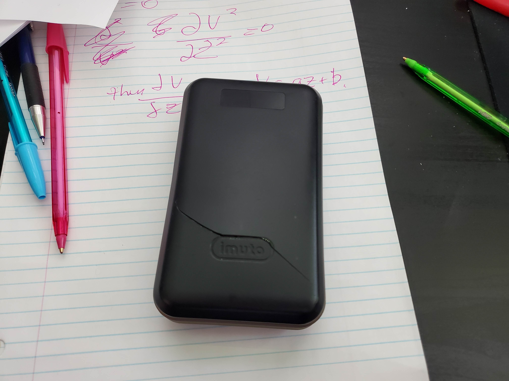
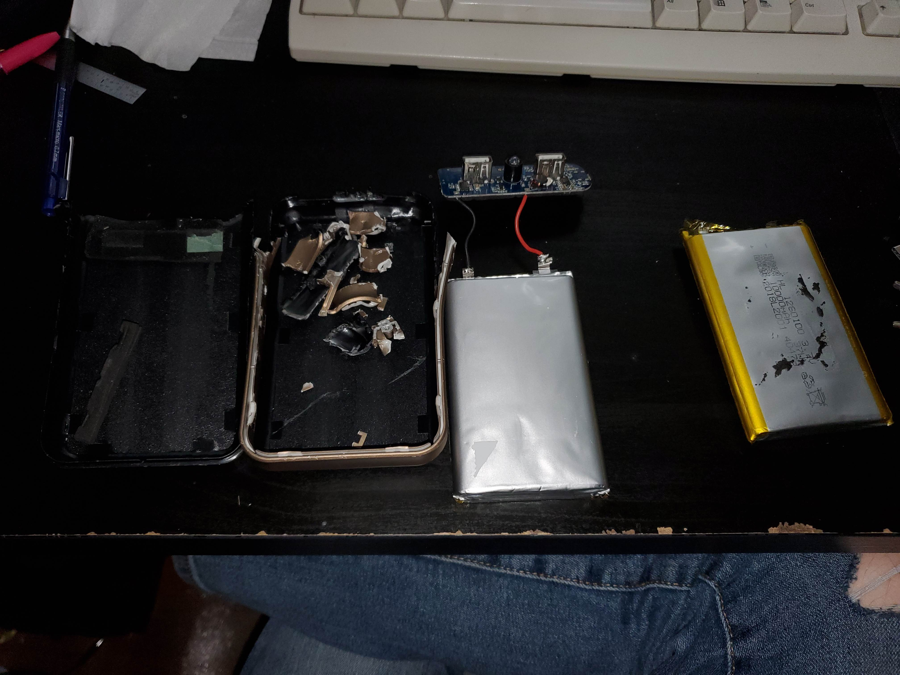
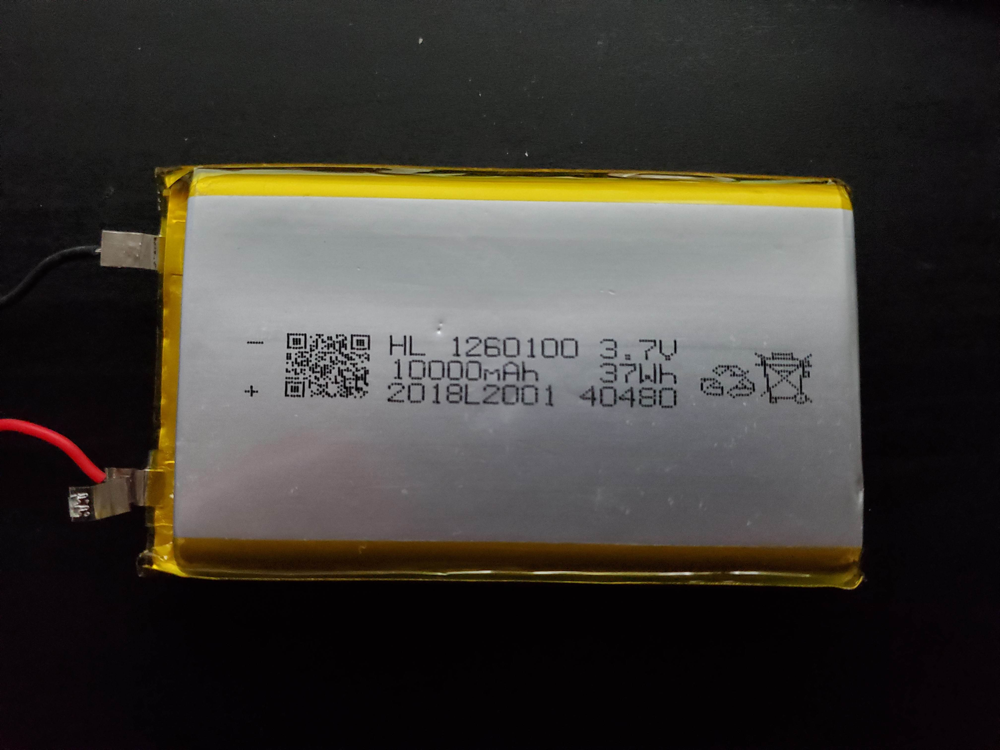

I had an old power bank, specifically an *imuto x4l 20000mAh* power bank. It was nothing special, just a simple power bank with 2 USB A out ports, and micro B in. It also had a cheap LED flashlight. It charged devices and could be charged at 5V 2A, so again pretty generic. 

It had been sitting in a drawer, and recently I saw a decent size crack in the battery, implying that the actual cells are swelling. So I need to throw it out since I should really not use it anymore due to the gas being emitted. 

I decided to take it apart since why not. This was actually very hard. The power bank was definitely not meant to be opened, there ended up being some clips on the inside of the battery that were really tight, and could only be opened from the inside... Sad... But the way I opened it was using some pliers and cutters from the front. I reached in through the small hole around the LED flashlight, and just pried. I wanted to use a saw or a heated knife, but I did not want to risk puncturing the battery. 

Finally I got into the battery, and it was pretty much as I expected. There are 2 10000mAh LiPO cells connected in parallel (one on top of another, both of their + and - terminals are connected). The cells are at 3.7v nominal, and the built in led screen reports arount 70% which makes sense since my voltmeter reports arount 3.85V. 

# Reuse?
Only one of the cells was bloated, and the other one was fine. Since they were in parallel, I might be able to still operate the power bank using only one of the cells. 

I would just need to make sure that the cell would be able to handle the increased load since now the 10w (actually slightly more) would be on one cell rather than split between 2 cells. 

The [datasheet](https://www.fpbattery.com/product/3-7v-10000mah-1260100-lithium-polymer-battery/) says that it can discharge/charge at 0.2C which means 5 hour charge/discharge time. Or with a max charge of 1C but not continuous. Now when charging another device, it would potentially be drawing arount 1.5 times the 10w due to inneficiencies, so about 15w (this is just a very rough guess). So this means for the 37WHr battery, it is going at about 0.4C.

So do I want to risk it with 0.4C discharge rate? Probably it would be fine, but why risk it. I have other power banks, so I think I will just toss it since I do not need it, and I don't think it is worth the risk for me. 

> Of course I will properly dispose of the LiPO cells since these are very dangerous and should **NOT EVER** be thrown straight into the dump.

