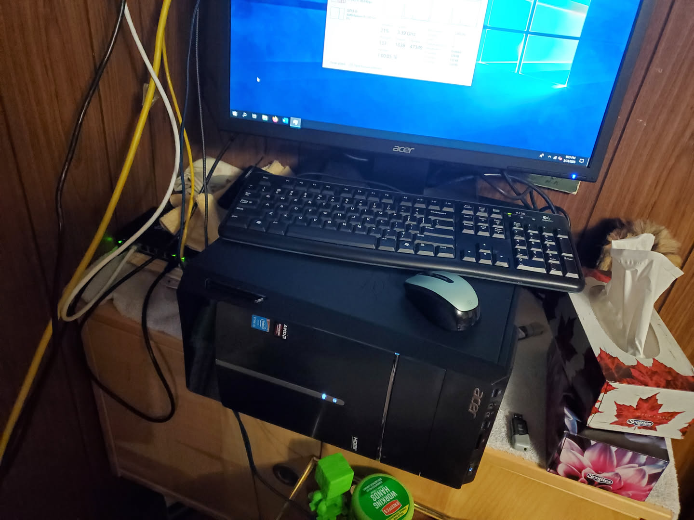
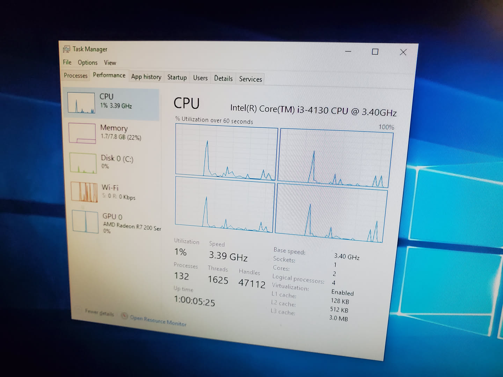
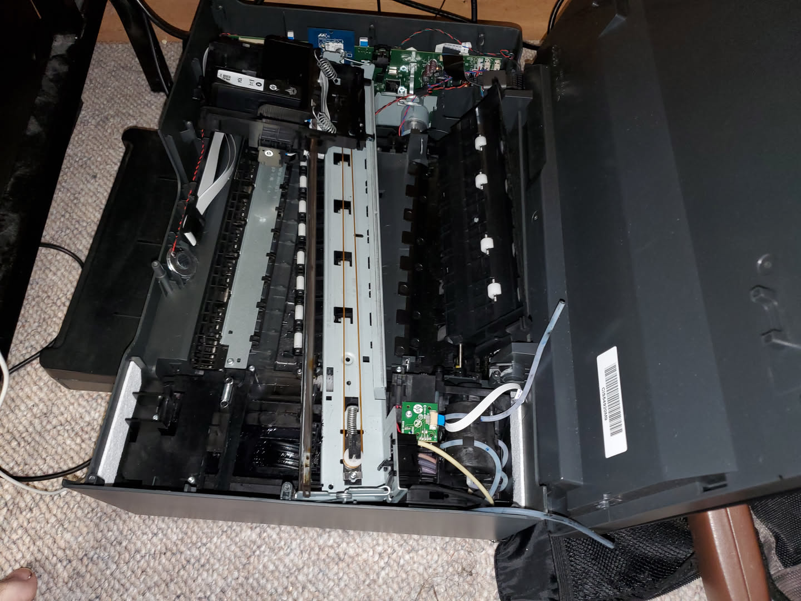
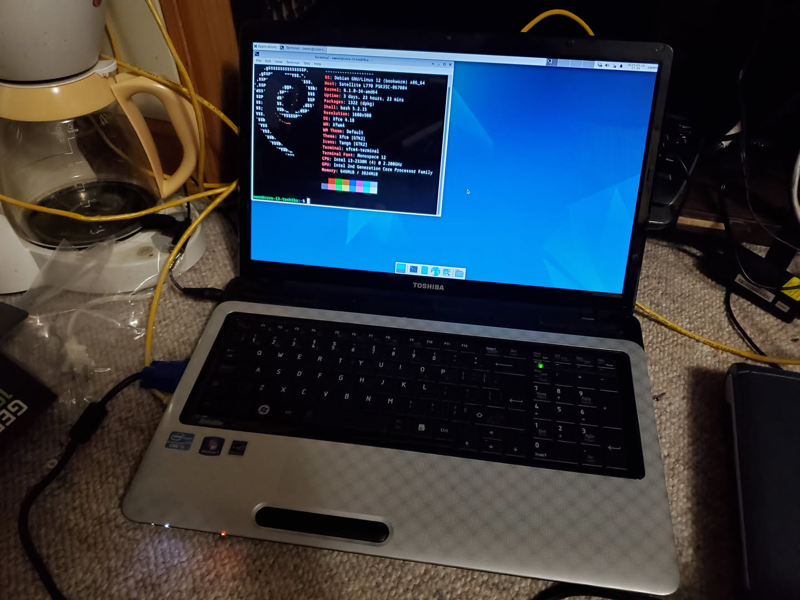

About a week ago I found lots of technology around the town. I am still going through this technology and playing around with it. I have had lots of fun and frustration!! :-)

### Old acer computer

I found an old acer desktop computer that would not boot. It just beeped upon turning it on. The first thing I did was test the RAM since this error indicates likely dead RAM, dead CPU, dead motherboard, or maybe dead GPU. I was correct. One of the DIMMs was dead, so I replaced it with a spare I had lying around to get it working again. 

The computer itself is nothing special, 4th gen core i3, and 8gb ram. I put windows 10 2019 ltsc on it since I think that is a good option for its age, and it will help me when I need to do some bare metal stuff on windows such as odin3, or annoying printer drivers that don't work on linux. While I could technically do lots of this stuff either directly on linux, or through a windows VM, I don't want to deal with the headaches. 

### Printers

I took apart that old HP inkjet printer I have since it was giving a printer head issue. Now I cannot replace the printer head since thank you HP (I am not an HP fan btw). I tried cleaning it all up, using alcohol to clean the head, but nothing. I looked at the discarded ink tank, and this was full. Even the tubes going to the tank were full. I emptied the tank, and cleaned out the tubes, and still nothing. Now the ink had not actually gone far up into the tubes, so I do not think it caused any damage to the printer. 

I think the printer does not work since when the waste place overflowed, the printer flipped a bit basically bricking the printer for good, and there is no way to unflip that bit. Although this is just guessing. I could be completely wrong, and there could be a different reason for this, but based on what I know about Hewlett Packard and the inkjet printer industry as a whole, I would not at all be surprised that this is what they did. 

### Old toshiba laptop

This laptop was in pretty much perfect shape other than it was missing the hdd, battery, and DC power supply. I had a spare power supply, and hard drive. While I did not have a spare battery, luckily this laptop (like many laptops) can run directly off of the dc power supply. It does not run through the battery which itself gets charged by the power supply (looking at asus g14 over usb pd...)

So with the new power supply, and ssd, it works good as new and is fine for testing. 2nd gen core i3, and 4gb ram, so not much but will help for my networking test area which I hope to get some use out of. 

### Old ipad
There is an old iPad air, and I was able to reset it, but I could not actually get in due to the silly icloud lock. In my opinion, Apple really needs to fix this. It creates unnecessary ewaste. And for those people saying "You have such an old tablet that is useless!!" well my main tablet I use is from 2015, 10years old!! It still works fine for my needs. Maybe not for everyones needs, but for mine it works fine. 

This iPad is in perfect condition, but due to SILLY ICLOUD LOCK and there being no way to get it removed since I do not have any ownership documents (I found it being thrown out) and Apple won't even give me the icloud email address (to contact the user to ask them), I am out of luck. 

### Old galaxy tab A. 
This one had a broken micro usb charging port, somehow the inner part of the port was removed. I tried to take it apart to see if it was replacable, but WOW. This tablet is almost impossible to take apart. I still have not found out how to get access to the charging port part of the case without destroying the whole thing. I was able to kind of get in from the screen, but this ended up killing the screen (since I had to seperate the panel from the backlight)... Probably there is a way in, but I am unable to find it. Or maybe this is just a user unfriendly design. 