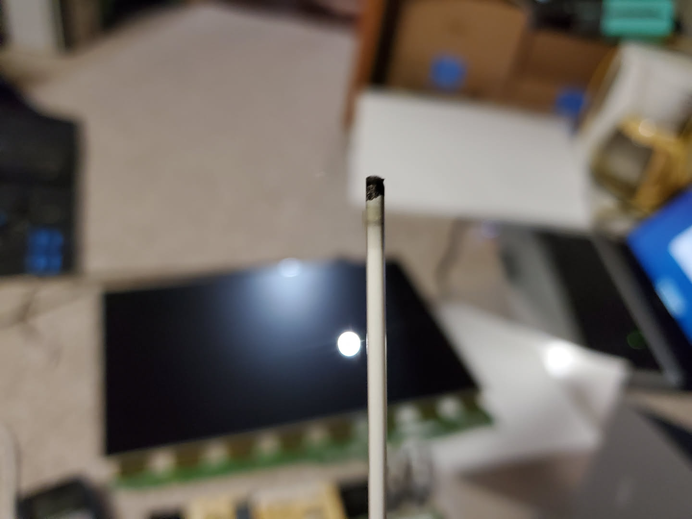
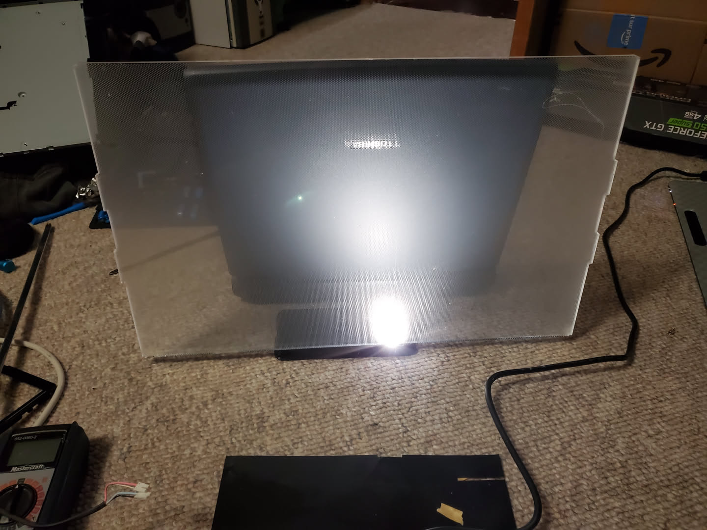
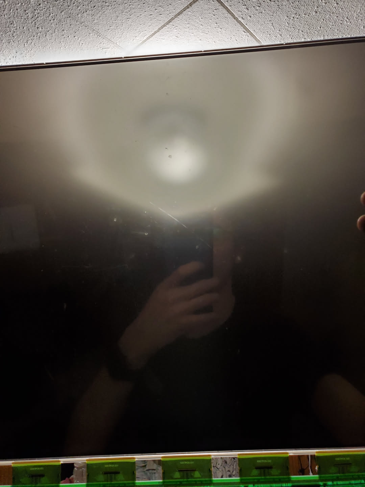
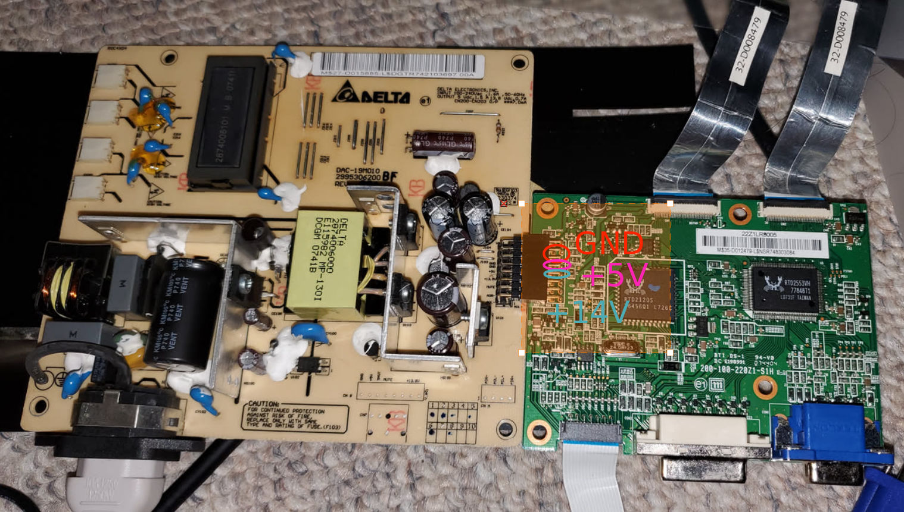
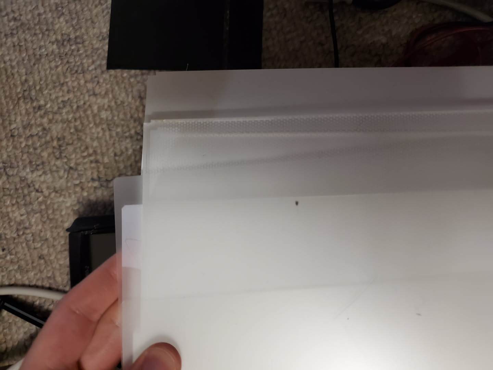

I have an old monitor that I found on the side of the road. Upon plugging it in, it did not work. I would turn it on and the screen would flicker quickly, and then nothing. It did this a few times, and then just nothing would happen when turning on the screen except for the status LED being green. I decided to take it apart and try to fix it. It was not too hard to get into the monitor and get it down to the circuit board, the display, and the backlight. 

I then did some testing, reseating all of the components and such. After plugging back in, I found that the backlight then had stopped working. Upon disassembling that, I found that the fluorescent tubes were dead. They all had this black burn mark close to both ends. 

I decided to disconnect these and look check the actual panel. Through doing this, I have a display that works. I could see the picture if I shone a flashlight through the panel. I then set up a temporary fix where I set up the back plastic diffusion panel of the backlight using a flashlight of a phone. I used google pixel 7 since it has a bright big LED. (The laptop behind it is just to hold the "backlight" up and prevent it from falling)

Then I put the LCD panel in front of this backing, and I had a semi working monitor. I connected an old laptop to the control board using VGA and 120VAC to the C14 socket, and I was good. Then I wanted to do some more digging, and this is where I started running into more issues. 

I wanted to find out why the fluorescent tubes had all four of them stopped working. I tested the voltage coming out of the 4 ports for each of the 4 tubes, and nothing. No DC voltage, or ac voltage (I did not know whether fluorescent tubes are DC only or can work with ac so I tried both). So I figured that that part of the power supply must have died. 

Then later I tested the monitor again, and nothing. The status LED did not turn on, and there was no display signal on the screen. 

I think I must have somehow dislodged something, or maybe the power supply was already dying and I just got bad luck to catch even more of it dying, but whatever. I did some testing, and using the markings on the board, I found out that the outputs from the DC converter board are as follows:

The other pins did something else that I did not know about. 

Testing these, I found that the 5V pins were not supplying 5v power. They were not supplying any power at all. Testing all the capacitors on the DC board as well showed that they were working fine (or at least outputting a constant voltage as expected), so probably not an issue there. It seemed like the 5V portion of the DC power supply had died. So I tried replacing that part using a standard USB power supply. I connected those leads to the board, and it worked for a few minutes, until then it stopped again. I don't know what I did, whether this was a bad idea, or whether the entire power supply is just dying. 

Regardless, this was a fun project. I got to see all of the layers of an LCD monitor, and try to diagnose the problems. Ultimately I failed to fix it, but I did not really care about it. The monitor had a "certified for windows vista" sticker on it, so it was probably like 1600*900 resolution or something like that (16:9 ratio). I have more than enough monitors that are at least that resolution or higher, and it probably would be very hard to sell. So I am fine not being able to fix it. 

What I think happened, is that when I got the monitor the DC converter was dying. Upon plugging in I think that it was giving voltage surges which is why it would flicker. These surges killed the bulbs. Then I think that it kept dying and killed the 5VDC signal, and then finally something else went wrong maybe with the other pins on the DC power supply - control board bridge or something else. This is just speculation, I could be wrong. 

^ These are the layers of the backlight. 