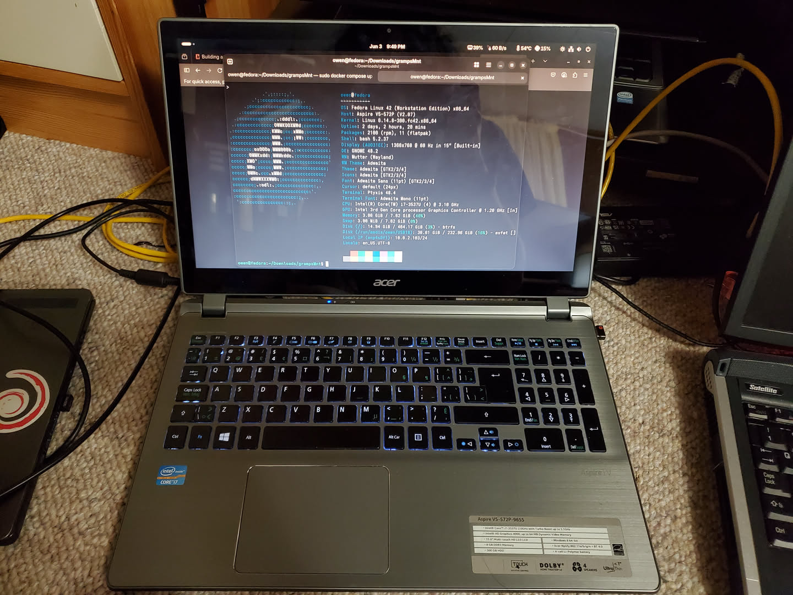
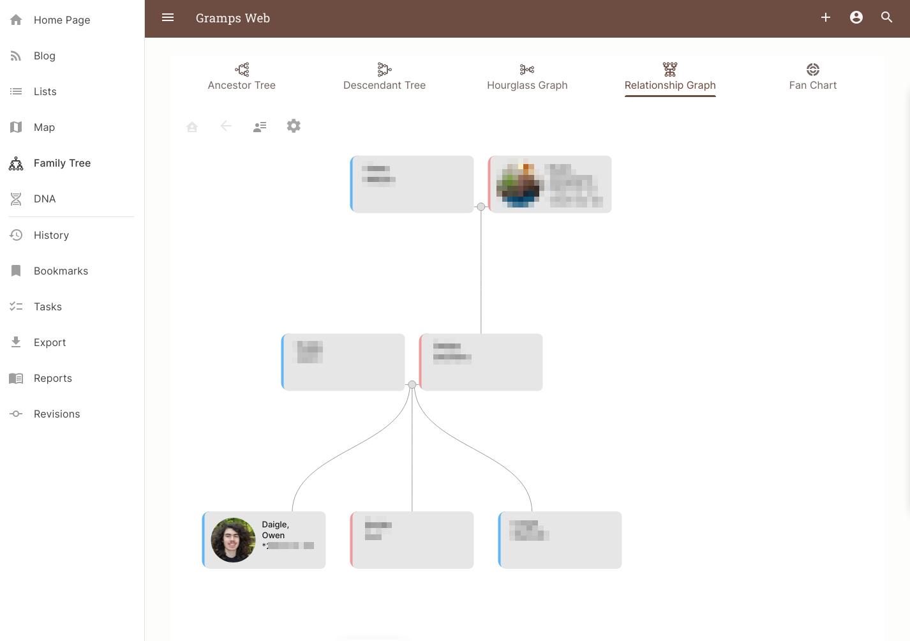
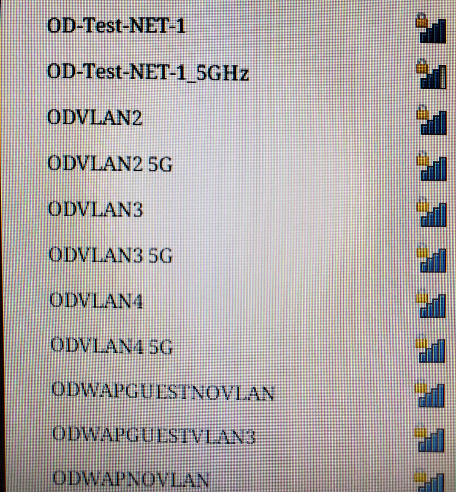

This is kind of a 2 part post. The first part is I got a new laptop. Not actually a new laptop, but new to me. This laptop is actually special since it has a touch screen. While I have a MS Surface Pro 7, it does not work under linux. And the touch screen is also wonky. This laptop actually has a good screen (although only 1366*768). 



Of note:

| - | - |
| CPU | Core i7 3537U (2 Cores) |
| RAM | 8GB DDR3 |
| OS | Fedora 42 |
| Screen | 1366x768 15in touchscreen |
| Disk | 500GB HDD |

Initially there was windows 8 and it was slow as anything. This was even a fresh install of windows 8. And it was mega slow. I expected this was due to the old mechanical HDD, but after putting linux on there, it is way faster. Like I mean it is actually usable in my opinion (although programs take a couple seconds to open). I will not be upgrading to SSD since it is just for testing, and it is usable. 

I decided to put fedora on there since it has a fairly new version of Gnome, which I think is pretty good for touch screens. I tested out the touch screen, and it seems that for everything it works fine. There were no preinstalled programs that did not support the touch screen. They all worked flawlessly, I was actually surprised coming from my MS surface with windows 11. This is a much smoother experience. 

Now I did have to take out the battery of this machine, since it is very swolen. 

## Docker Testing and Gramps
I came across this cool piece of software called Gramps Web. It is a self hostable Geneaology program. I do not do geneaology, but a relative does. So for fun, I decided to set it up but I put my own spin on it. 

I wanted to put it into a VM to containerize it, but did not want to deal with that. I thought docker would be easier, but it kind of creates a mess of files with the host system which is more annoying than a single disk image for a VM. 

So I thought why not use a single disk image for docker? Just put everything in that disk image. 

I ran a few commands to create a virtual disk:
```bash
dd if=/dev/zero of=./testGramps.img bs=1M count=2000
mkfs -t ext4 ./testGramps.img
resize2fs testGramps.img -m #to get rid of all the zeros that I filled it with
e2fsck -f testGramps.img & resize2fs testGramps.img 2G #get back to 2G
mount testGramps.img <<mountPoint>>
```

Then I created my directory structure of:
```
mountPoint
-> docker-compose.yml
-> data
---> cache
---> db
---> index
---> media
---> secret
---> thumb_cache
---> tmp
---> users
```
Then I used the [gramps docker compose file](https://raw.githubusercontent.com/gramps-project/gramps-web-docs/main/examples/docker-compose-base/docker-compose.yml) and added my directories as bind mounts. I also mapped the port to 5001 since idk if 80 is already being used on my system and I want to avoid headaches if possible. 

Then I ran `docker compose up` while in the correct directory and it worked perfectly!!



Now I tried to access this from 2 other devices on the network, and for some reason it did not work. 

I have an annoying router from my ISP that seems to give me some issues here and there, and it also does not let the user access the management interface. For an average user it is probably fine, but for me it does not work. One of the problems is I think it does something with blocking non-standard ports on the lan, or something like that. I have not fully figured out/tested this. 

So I fixed by transferring the entire disk image to another computer (specifically the new one running fedora) and set it up again. Since everything was isolated into that one image, it was plug and play!! Now I can connect assuming I connect my device to the correct vlan (it is my test net so I have way too many networks, most of which can probably be deleted)

And it works!! No problem.

These are just some of my wifi networks I use for testing. 

