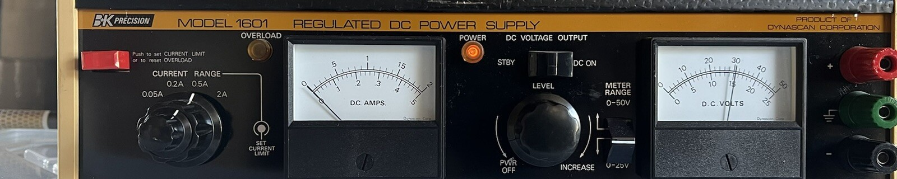

I was recently given an old DC power supply. This is one of those testing ones where I can vary the voltage, and set a current limit. It is the B+K Precision 1601 power supply. 

I was actually given 2 of these, and one of them works, and the other one did not. What would happen, is it would display a voltage on the screen, say 12V. But the actual voltage would be 12v, and then suddenly drop to 4v, and then up to 8v, and so on. All this time the display would keep showing 12v. 

Upon taking apart the device, I found that wiggling one pcb would cause the voltage to very often change. So it was probably a loose solder joint or something on this pcb. Luckliy this is an older device, so the parts were not very small. So I could look with my own eyes not through a microscope (since I do not have anything like that). 

I found after awhile that one of the ICs had some loose pins, so I resoldered those and POOF! The voltage now did not vary. This part of the power supply was fixed.

But it still did not work. While the voltage output now lined up with the voltage display, there was no current. As soon as I added a load to the system, the power supply voltage would immiediately drop to zero. Then upon removing the load, it would slowly crawl back up to the correct voltage. 

I had access to the [schematics](https://www.radiomuseum.org/r/dynascan_bk_precision_regulated_dc_power_supply_1601.html) for this power supply, so I found out what parts did what. 

I tested the current limit knob and checked that the 4 resistors worked, and everything in that part of the power supply made sense. 

Then I tested the AC to DC converter which is connected to a transformer with 4 taps. Each of these taps would step down the AC voltage to a different value. The transformer worked, as did the AC to DC converter part. A stable DC voltage existed at the end of this circuit which was verified using the oscilloscope. 

Then I thought maybe the current overload circuit was the problem. Reading the [service manual](https://www.radiomuseum.org/r/dynascan_bk_precision_regulated_dc_power_supply_1601.html), and looking at the schematic, I found that there is a certain resistor in series with the output. The voltage is measured off of this, and it is fed into an IC. If the voltage exceeds 1V, it feeds into another IC which grounds a part of the circuit. Upon checking, this was not happening. So now I was confused.

I started going through all of the components that were not in all of the circuits I had tested, and measuring their values and comparing with the schematic values, and then resoldering both joints in case. I spent awhile doing this, and then late at night I went to bed still not having solved it, or so I thought. 

A couple days later I decided to take another stab at the problem, and I tested the power supply and it worked. I must have fixed it the last time, and being very tired somehow messed up my testing to make me think it was still broken. I moved the power supply around, bent boards wires, etc to check if it was just some solder connected or something temporary, and it continued working. I left it and tested it again the next day, and it still works!! So hopefully this is fixed now!