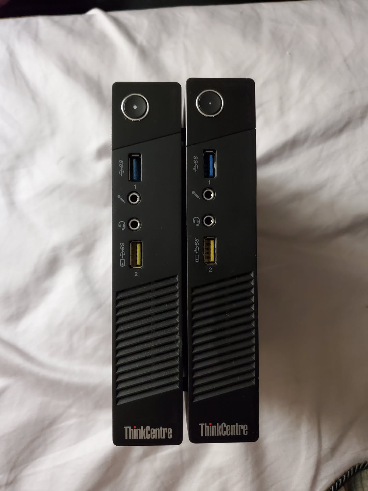
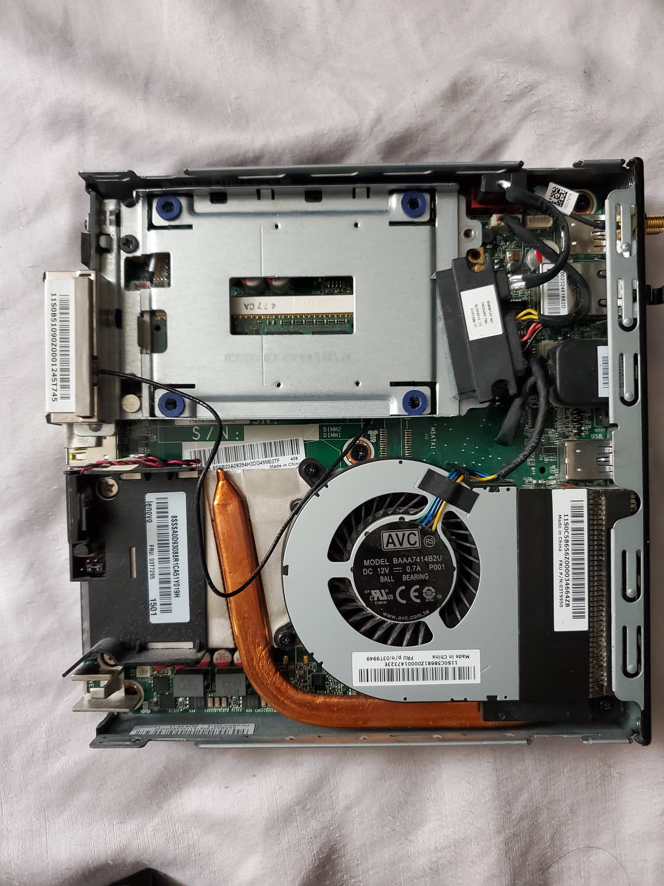
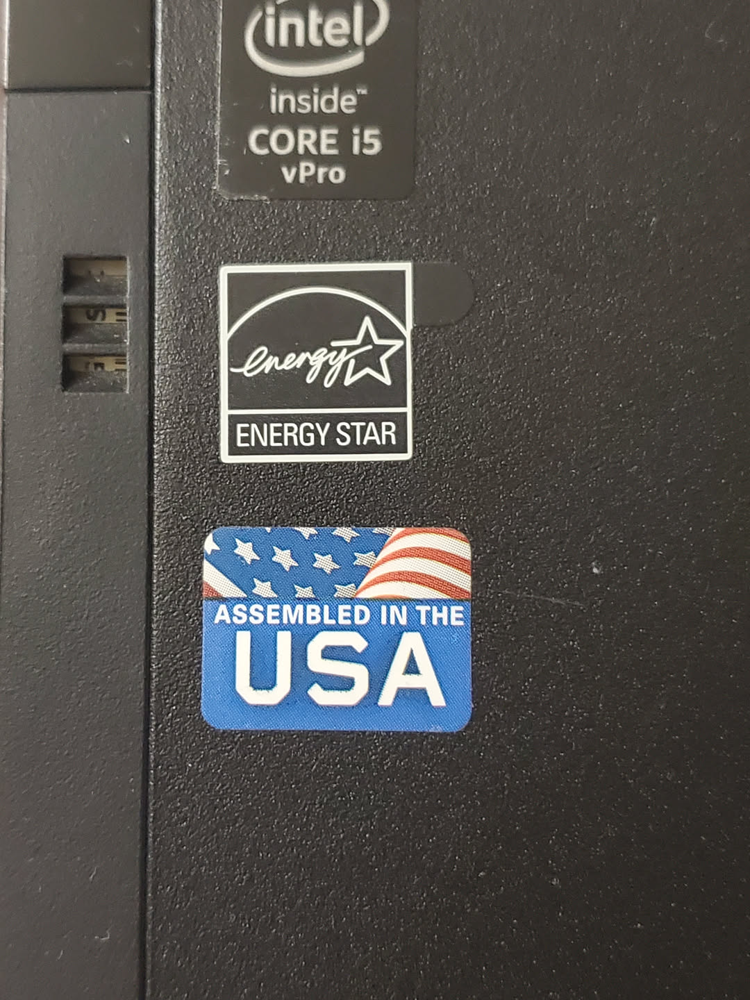
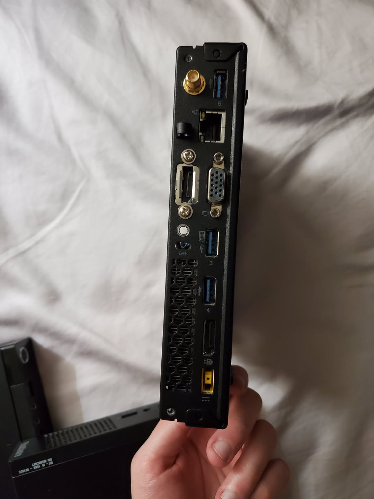

I was looking at the reuse center at a dump and I saw two lenovo mini PCs that looked fine, they were just covered in bird poop. I took them home, cleaned them up, and then took them apart to find that there was *no RAM or ssd present*. The actual computers looked in good shape though. 

I had some RAM lying around, and I had a generic laptop power supply with lots of different tips including a lenovo one, so I put the RAM in, connected it, and booted a live linux image. It booted fine. I tried the other computer and it was fine as well. So I ordered some RAM and SSD for the computers and now I have two lenovo mini PCs. 

These are interesting because they are very small, but still decently powerful. They do have the **intel t series CPUs** which are lower power than their "full" desktop CPUs, but they are not as bad as the laptop ones. The desktop is actually quite quiet in that even when operating in "turbo" mode I still can barely hear the fan... I am actually surprised. The build quality feels very good, and oddly enough this is I think the only desktop computer I have ever seen with 0 USB 2.0 ports, it only has 5 USB 3.0 ports (I know USB 2.0 devices will just use the 2.0 pins and controller, so they can all operate in 2.0 mode, but still).

It also has this *very annoying* US flag on it, which normally I would be fine with, but with a certain incompetent president (that somehow got voted in) in charge, I do not want a US flag on anything I own... 

I don't know exactly what I will do with these things, I might try to put arch on them at some point, I have never tried installing it. I might also see about testing out the vPRO features since they both have vPRO CPUs. 

The specs are:

| Part | Spec 1 | Spec 2 | 
| - | - | - |
| Model | Lenovo m93p | same |
| CPU | Core i5 4570t | same |
| RAM | 16GB | 4GB |
| RAM speed | 1600MHz | same |
| SSD | 120GB | na |
| GPU | Intel HD 4600 | same |

