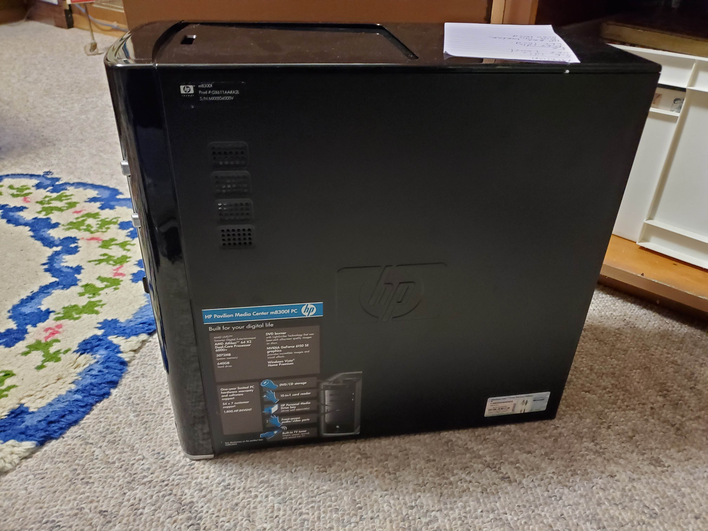
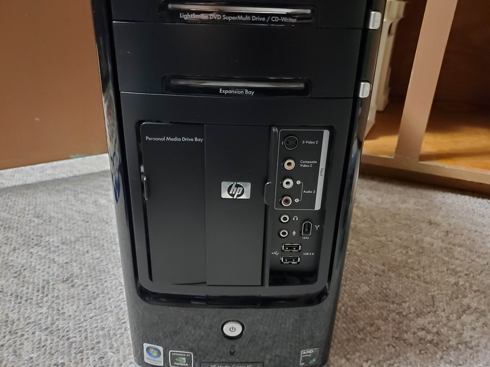
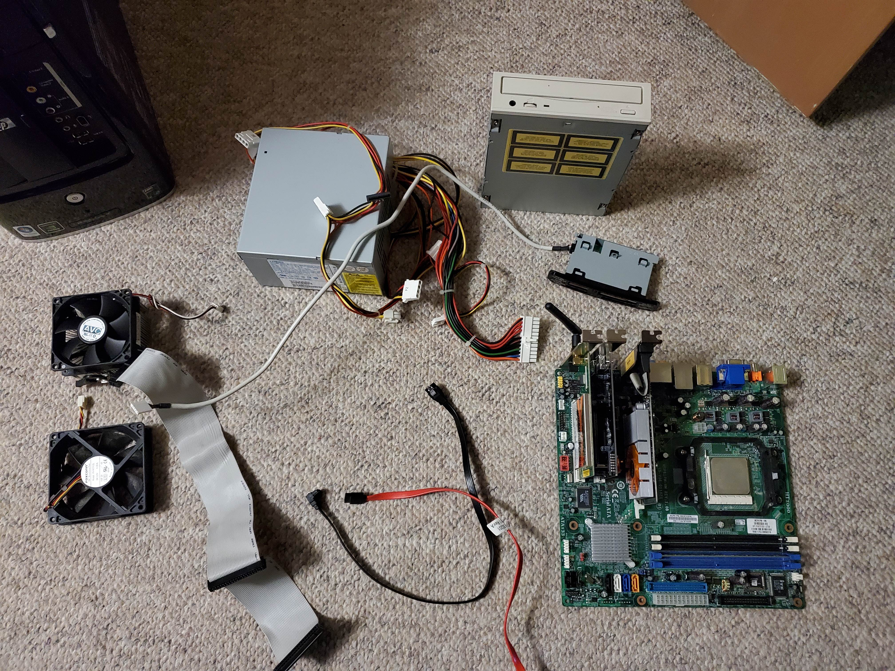

This is something that I have been working on for a few years off and on, and finally I am actually concluding it. 

I have this old HP m8300f "media center" computer. This is an interesting piece of hardware since it has a bay in the front for an external hard drive to be docked INSIDE the computer!! Cool!! It also has all sorts of video in ports on the front panel, and some other cool stuff.

# Problems
This computer had a weird problem where it would often crash after using it for a few minutes to an hour. This was whether the computer was being stressed, or not.

This sounds like a RAM/CPU/Motherboard issue, somewhere there. I tried replacing the ram with some other stuff I had lying around, tried out different slots, different DIMMs, different capacities, and no matter what I did it still crashed. I tried different operating systems such as Windows 7 (which was preinstalled), and various linux distributions. For some reason, I could not ever get debian to boot. Linux mint worked, Fedora linux worked, but not debian. It would always kernel panic on installer boot. 

Although it did not really matter since both fedora and mint had the same crashing problems as expected.

> This crash was not a kernel panic or anything like that, the device would just freeze on screen, nothing would change it would continue to have fans running, and so on, just the screen would be frozen, no keyboard shortcuts would work, like the entire thing was frozen.

I tried removing all addin cards and stuff such as dGPU, USB card, HDDs, Front panel, and everything not crucial for the computer to boot since these things do add more stress to the chipset. It still crashed. So I am positive it is something to do with the motherboard or cpu. 

# Reusing parts
Given the age of this computer, and the power usage (1.67A from the wall under load, just under 1 idle) there was not much I could reuse. The RAM seems to work, so I will add that to my already good size DDR2 collection, I can reuse the GPU for a simple display adapter (Nvidia GT520), but the others I am not sure. 

There is a CD rom drive, but it is just a CD rom, no DVD support or anything. While the computer originally came with a lightscribe drive, the drive was changed at some point for this inferior one. While lightscribe would be cool to test out, and I have a lightscribe drive, I have no disks. Also a wifi card (2.4GHz only) and USB 2 addin card (PCI) as well as a 300W power supply. This power supply might actually be useful since it supports up to 175W on the 3.3V rail which iirc many power supplies do not. So it may be useful for an older PC build. This is if I trust it not to blow up ;-)

The only really useful thing I can find is the mutimedia card reader. It uses a simple USB 2 header so I could use this in the future to read my memory cards (while being limited to ~40MBps).

