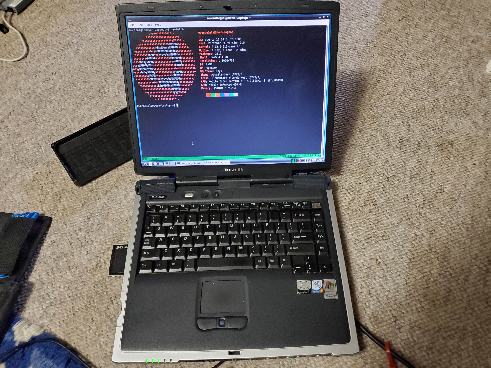

I have this old toshiba satellite laptop I am working with. It has the following specs:

| Spec | Value |
| - | - |
| CPU | Pentium 4 @ 1.8 GHz |
| RAM | 768 MHz | 
| Stock OS | Windows XP |
| Current OS | Ubuntu 18.04 with LXDE |
| HDD | 40GB |
| Display | 1024x768 |

There were some problems with this laptop. First, the floppy disk drive did not work, so I took the laptop apart and reseated that connector which fixed the problem. When I did that, somehow I lost the spring and latch for the lid opening mechanism, so it would not stay closed. I used some string and a spring from a pen to fix this. Then the ribbon cable for the power button daughterboard would not stay in place. It kept coming out. I fixed this by putting some tape over the top of the cables (not the side with the contacts) which increased the thickness of the cable. Now after a little bit of cleaning, the laptop works well. 

# IO Testing
I tested the io performance of the internal IDE hard disk and obtained the following results:

Random Write/Read: 300kb/s

Sequential Write/Read: 20mb/s

I was using `fio` to do these tests and for the random ones I used 
```
fio --size=150M --readwrite=randrw
``` 
and for the sequential ones I ran either:

```
fio --size=150M --readwrite=read
fio --size=150M --readwrite=write
```

Although when I run `--readwrite=readwrite`, it gets half the performance at about 10 mb/s which makes sense since it is concurrently running both tests. This points to some sort of hard limit of about 20 mb/s on the ide connection.

Searching up the disk, it is a Hitachi DK23DA-4 4200RPM.

Since these numbers are very low, I could probably even replace the hard drive with a compact flash (CF) card and get better performance. CF is good since it is the same pinout as ide, so it just needs an adapter to take the ide size and scale it down for cf. 

# Network Testing
Unfortunately where I am right now there is not a good wifi network, and I did not have a spare AP for testing.

From my testing, I found I could get about 10 mb/s over the network, but I am not certain this is not a limit imposed by the AP. I was able to get closer to 20 mb/s using another set of computers however so I think my values are decent???

Over ethernet, I am able to get the full 100mb/s the port supports. However, interestingly just running a CLI test iperf3 sends the CPU usage to about 90% doing the full 100 mb/s. So this computer could definitely not do much more than the 100mb/s port it is equipped with. 

Although, under load using `stress --cpu 1`, the performance was still at the max 100mb/s. It did not decrease interestingly. 

This was tested using iperf3 using multiple modes, all giving similar results. However, with TCP, there was about 5-10% higher cpu usage to be expected due to the more overhead present with TCP.

```
iperf3 -c 192.168.50.5 
iperf3 -c 192.168.50.5 -u -b 0
```

I also tested the computer for a long time under tcp to see if the performance would degrade, and it did not. 

```
iperf3 -c 192.168.50.5 -t 5000
```

# Other testing
I also tried lots of other things on this laptop.

I tried to use it to browse the web, but all modern browsers max out the cpu and ram usage. I thought of using an older browser, and while I can run ones such as internet explorer, they are not practical to use in 2025 except to browse [the old net](https://theoldnet.com/). I thought of using a terminal based browser, but afaik, these all use something like firefox to do the actual heavy lifting. 

I tried to run a 1.17 minecraft server (chose 1.17 since before the big update that extends the world down a lot increasing memory usage) and *technically it worked* however it was not at all playable (chunks loaded in ridiculously slow like 30s per chunk and it crashed after like 5 minutes).

I even made some basic java programs in java 17 which technically worked, but it took 10 or so seconds to even compile the java file. Python was not any better since it took a few seconds for the interpreter to run the code. 

I really should try some period accurate things such as running windows xp and some light games from the period (or the few years prior given its a laptop) but not today, I don't have my windows xp installation disks with me and while I do have a disk burner and some disks, I do not have the iso and don't want to download it over 5mbps internet. 