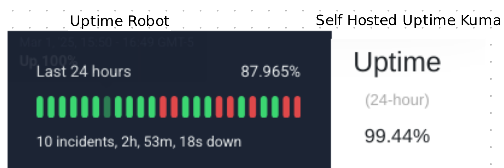

# Problem

I host my website as well as a lot of other services by port forwarding the open ports to the internet. I use cloudfare proxy for eerything that I can (all web services) and other services are opened directly to the web. I have a reverse proxy running as well for all services. 

I also use a dynamic DNS service so whenever my public IP address changes, my website is still accessible. I use the one built into my consumer router (asus ddns) since it is easy.

Basically the layout is the following:

```
bare metal (running container)  -->  reverse proxy  --> asus DDNS  -->  cloudfare dns (odaigle.xyz) --> web
```

This should in theory work well, but I have been having some issues for awhile where stuff would usually work, but every now and then the website would go down. This would give a 530 error from cloudfare. Now this was weird, since my [internal status monitor](https://up.odaigle.xyz) would often (but not always) still show the service as *up* even when I was attempting to access it from multiple devices and getting 530. 

I also once did some more thourough testing where I had 2 computers on the LAN on, and 3 devices on the WAN. (I was remoted into the 2 on the lan while physically being somewhere else). To rule out cloudfare blocking the remote IP, I had 2 devices connected to different VPN servers, and one device not connected via VPN. The 2 LAN devices could connect to odaigle.xyz with no problems (used wget and private browsing with cache cleared to rule out local cache) and the 3 WAN devices would not connect with error 530. 

I started doing some more testing such as implementing an internet uptime tracker (which showed extremely high uptime) and a third party uptime tracker (uptimerobot). uptimerobot showed that the website does go down much more than the internal status tracker says. 



I know now that the problem is not the servers themselves, and I do not think it is cloudfare nor the reverse proxy. Cloudfare is well known to have good uptime, and I can access through the reverse proxy on the local network.

This points to a problem with asus DDNS (which is supported by online reports of instability with the service). This does not fully explain why the service is still up on the local network when it is down for the world. A theory I have is that my router on my network does some smart stuff and any request sent to the router with my asus DDNS hostname gets routed back to the local network. I am not certain about this, but it would explain what is going on.

# Potential Solution

I am in the process of implementing a service called [ddclient](https://github.com/ddclient/ddclient) which will allow me to run this service on a computer on my LAN, and whenever it detects the public IP changes, it will ping cloudfare and change the IP there. 

I did some testing on a non production domain with an unused subdomain of odaigle.xyz, and it worked fine. 

I just set it up on my production network and it seems to work fine. It should check the dns every 5 minutes, so if the public ip of the network changes (it rarely does), it should be back up and running within 5 minutes. 

> I know that I should do some more testing before pushing it to production, but I don't want to and at the end of the day it does not really matter if it goes down for a bit because of this as my website is really not that important. Also I was already having issues with the previous ddns service meaning lots of downtime. 