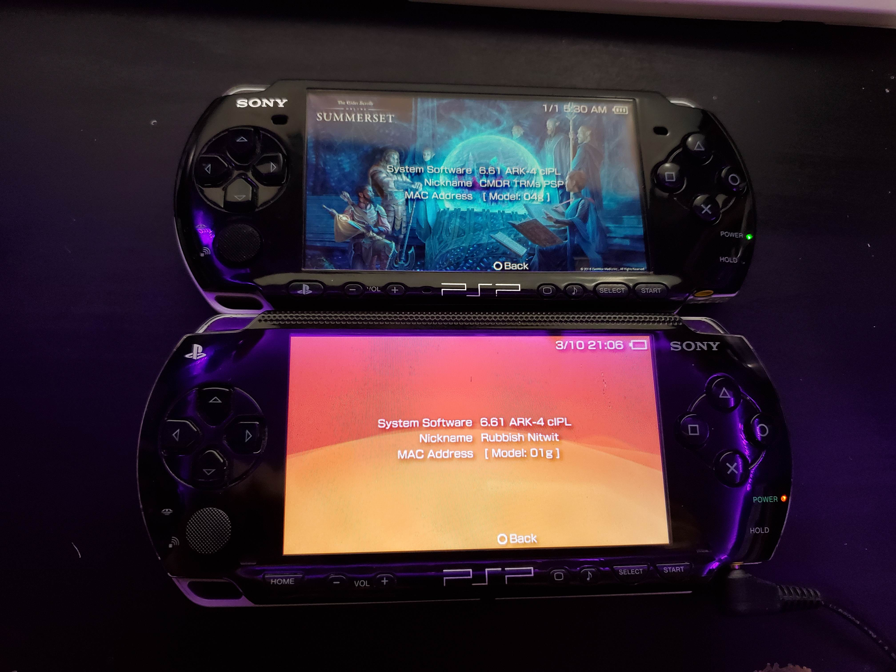

I have a couple of old Sony Play Station Portables (PSPs) and I decided to install custom firmware on them, specifically [ark4](https://github.com/PSP-Archive/ARK-4). I have the PSP 1001, and 3001.

I have installed lots of custom roms on android phones before, and stuff like that, but never on PSPs. So I was expecting it to be at least as complex as on the phones, but surprisingly this was very easy, in fact I spent a lot of time looking into this since it seemed like it was too easy. I was scared I was on some sort of malware site or something since it was as simple as downloading the custom firmware package, putting it onto a memory card, inserting the memory card into the PSP, then it would show up as an installed game. 

Running the "game" brings me into a live ark4 environment in which I can use an exploit cIPL to then fully flash the files to the internal storage. I do not have to really do anything since I just run another "game" called something like `cIPL exploit` and it will install, and then reboot, and then I can directly install the full ark4 package giving me access to some tweaks. 

One of the main reasons I put ark4 on there is since the UMD drive on my PSP is very buggy, if I put even the slightest pressure on it, it disconnects... I made ISO dumps of the disks before, so I can put these backups on the memory card, but stock software does not permit this, ark4 does. 

Running official psp games works fine, and even unofficial ones work mostly fine. The only issue I came across was that one game (a minecraft like clone for the PSP) did not work at all. It would start up, but as soon as I tried to load a game, it would crash the whole system. I thought this might be due to the 32mb of RAM present in my psp 1001 since all subsequent models have 64mb, and after flashing ark4 on my 3001, it worked fine supporting my theory. I will still use the 1001 since it feels more solid (and does not have problems with the shoulder buttons).

I also tested out some plugins improving functionality (such as adding battery percent on game menu screen), and I made a custom theme for the ark4 custom launcher. 

# Memory Card

Originally I was using a 4gb memory card that I had lying around, but this was not much storage as UMDs could store up to 1.8gb of files, and games are often around the 1gb mark. As MS Pro duo cards are expensive, and only go up to 32gb officially (and are hard to come by), I ordered a MS pro duo to micro sd card adapter online and put in it a random 128gb card I had lying around. This worked well and allowed me to put more games on the psp. 

# Movies
I wanted to put a couple of movies on the PSP just because I could, but after copying them over to the correct folder, the PSP could not read them. This was due to the PSP being very particular about the format of the video to be played. I thought I could just encode it to the right format, and that did work. I found a handbrake preset online so I did not have to figure it out by trial and error (I would have probably done something like h264 mp4 at 480*272 [psp screen resolution] and worked from there). Then after encoding the files could be viewed from the psp. 

Practically, I would not really want to watch anything on this screen since the screen is low resolution, and does not look that great, but it is cool.

# Conclusion
Overall this was a very easy project, it only took me a few hours to get it up and running, most of that was just reading up on the methods and stuff and wondering "How on earth is this so easy????". Coming from flashing stuff on modern android phones where I have to unlock the bootloader, and then often use proprietary leaked software like odin3 to then flash the custom recovery, and only then can I flash the actual operating system I want to run, this is very nice. 

I spent a lot more time just tinkering around, putting games on there, testing the games, customizing the software to my liking with plugins, themes, and stuff, and all sorts of tinkering. This is actually a nice device to use.